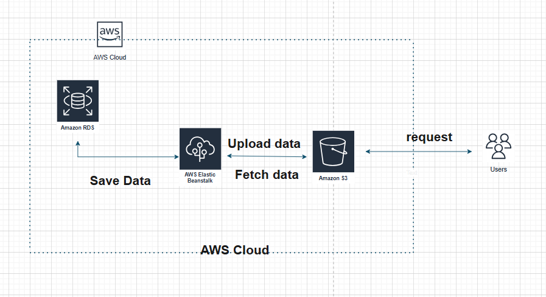

## Udagram Infrastructure

### S3 bucket
The frontend is deployed using AWS S3 bucket that is public.
User can use this bucket url to access Udagram application:
http://my-bucket-project4.s3.us-east-1.amazonaws.com/index.html

### Elastic Beanstalk
The backend server is deployed using AWS Elastic Beanstalk. 
Elastic Beanstalk url: http://udagram-api-dev.us-east-1.elasticbeanstalk.com

### RDS Postgres
The database use AWS RDS Postgres to store and achieve information.