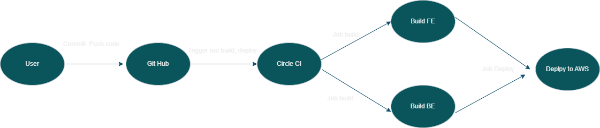

## Udagram Pipeline

## Continuous Integration
### Github
This Github repository is linked to the CircleCI platform. Any code is pushed to Github, it'll trigger the CircleCI.

### CircleCI
When running scripts in `package.json`, CircleCI will reads `.circleci\config.yml`. There are 2 jobs to be run:
- Frontend: Runs the frontend scripts in `package.json` then using AWS CLI to upload assets to S3 bucket.
- Backend: Runs the backend scripts in `package.json` then using AWS CLI to upload archive to S3 bucket.